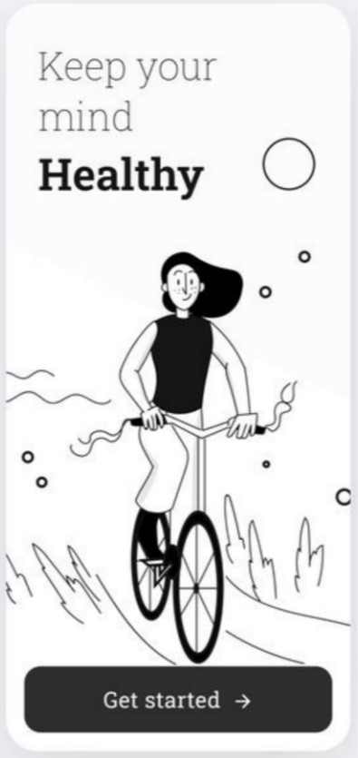
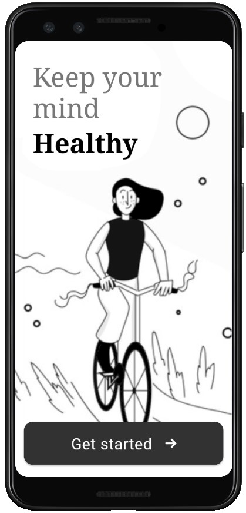

# Team
96521497 | Alimohammad Movahedian

96521434 | Pooya Kabiri
# Project description
We used `ConstraintLayout` as the parent ViewGroup of the activity. It includes two `TextView`s and one `MaterialButton`.

To benefit from good looking material widgets we import `android.material` library in the app's gradle file. To completely achieve the material design in the layout, we changed the AppTheme style to `Theme.MaterialComponents.Light.NoActionBar`

For better appearance we removed the status bar and bottom navigation bar programmatically.
# Result
| What we had to implement | Our implementation |
|--|--|
|  |  |
